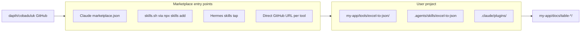

# Cross-tool compatibility & marketplace plan for excel-to-json

## Resume guide

**Status:** M5 complete · **Next milestone: M6** (manual smoke test matrix) · **M7** after public repo + `npx skills add` telemetry

| Item | Location |
|---|---|
| **Plan (canonical)** | [`design/plans/cross-tool-skills-migration.md`](cross-tool-skills-migration.md) |
| **Progress tracker** | [`design/cross-tool-compat.md`](../cross-tool-compat.md) |
| **GitHub target** | `dapih/cobaduluk` |

**To resume in a new chat**, paste:

> Continue implementing the cross-tool skills migration plan for excel-to-json. Read `design/plans/cross-tool-skills-migration.md` and `design/cross-tool-compat.md` for current milestone status. Continue from the first milestone marked **pending**.

**Locked decisions (do not re-debate unless you ask to change them):**
- Skills-first + Claude Code plugin as distribution wrapper (not either/or)
- Nested install in user projects (`my-app/tools/excel-to-json/`) — not standalone-only
- Marketplace-first install via GitHub URL (`/plugin marketplace add`, `npx skills add`, Hermes tap)
- Compat learnings → `design/cross-tool-compat.md`; pipeline learnings → `memory/learnings.md` (unchanged)

**Start here when implementing:** read `design/cross-tool-compat.md` → pick up at first **pending** milestone (currently **M1**).

---

> **Saved plan:** on execution, copy this file to [`design/plans/cross-tool-skills-migration.md`](design/plans/cross-tool-skills-migration.md) in the repo so it travels with the project.
>
> **Progress tracker:** [`design/cross-tool-compat.md`](design/cross-tool-compat.md) — milestones, checkpoints, test results, and append-only session log (failures, successes, changes). Separate from [`memory/learnings.md`](memory/learnings.md) which is for Excel-conversion pipeline insights only.

---

## Executive feedback: plugin vs skills vs marketplace

**Do not choose one or the other.** Use all three layers:

| Layer | Role | Install surface |
|---|---|---|
| **Marketplace catalog** | One GitHub URL → browse → install | Claude Code `/plugin marketplace add`, skills.sh, Hermes tap |
| **Skill (portable contract)** | [`skills/excel-to-json/SKILL.md`](skills/excel-to-json/SKILL.md) | `npx skills add`, `.agents/skills/`, agent skill tools |
| **Claude Code plugin wrapper** | Slash commands, agents, `${CLAUDE_PLUGIN_ROOT}` | `/plugin install excel-to-json@…` |
| **Deterministic core** | `scripts/`, `workflows/`, `templates/` | Always bundled with install |

**User flow you want:** marketplace first → select → install. That means every target tool gets a documented one-liner from your GitHub repo, not manual copy-paste of folders.



---

## Phase 0 — Marketplace publish (do this first)

Goal: anyone can install from `https://github.com/dapih/cobaduluk` without reading the full README.

### 0a. Claude Code plugin marketplace

Add [`.claude-plugin/marketplace.json`](.claude-plugin/marketplace.json) at repo root (single-plugin repo pattern):

```json
{
  "name": "cobaduluk",
  "description": "Excel-to-JSON and related agent tooling by Davi Muammar",
  "owner": { "name": "Davi Muammar", "url": "https://github.com/dapih" },
  "plugins": [
    {
      "name": "excel-to-json",
      "description": "Convert complex Excel tables into validated, schema-backed JSON",
      "version": "0.1.0",
      "author": { "name": "Davi Muammar", "email": "khadafi@gmail.com" },
      "homepage": "https://github.com/dapih/cobaduluk",
      "source": "."
    }
  ]
}
```

**User install (marketplace → select → install):**

```bash
# Step 1 — add marketplace (once)
/plugin marketplace add dapih/cobaduluk

# Step 2 — install plugin
/plugin install excel-to-json@cobaduluk
```

Also document HTTPS fallback for SSH issues: `git config --global url."https://github.com/".insteadOf git@github.com:`

Add [`scripts/validate_marketplace.py`](scripts/validate_marketplace.py): checks `marketplace.json` schema, `plugin.json` version match, required dirs (`commands/`, `skills/`, `scripts/`).

### 0b. skills.sh / vercel-labs skills CLI (covers most tools)

One command installs the skill into the correct agent directory for **Cursor, Codex, OpenCode, Antigravity, OpenClaw, Kilo, Hermes**, and 60+ others:

```bash
# List what's in the repo
npx skills add dapih/cobaduluk --list

# Install skill only (project scope)
npx skills add dapih/cobaduluk --skill excel-to-json --agent cursor
npx skills add dapih/cobaduluk --skill excel-to-json --agent codex
npx skills add dapih/cobaduluk --skill excel-to-json --agent opencode
npx skills add dapih/cobaduluk --skill excel-to-json --agent antigravity
npx skills add dapih/cobaduluk --skill excel-to-json --agent openclaw
npx skills add dapih/cobaduluk --skill excel-to-json --agent kilo
npx skills add dapih/cobaduluk --skill excel-to-json --agent hermes-agent

# Install to all detected agents at once
npx skills add dapih/cobaduluk --skill excel-to-json --all -y
```

**skills.sh listing:** no manual submission — run the first install yourself after the repo is public; telemetry adds it to [skills.sh](https://skills.sh). Document this in INSTALL.md.

**Important:** `npx skills add` copies/links the **skill folder only**. Users still need the full repo (scripts, workflows, agents) for the pipeline. Two options:

| Mode | What gets installed | Recommended |
|---|---|---|
| **A — Full plugin clone** | `git clone` / submodule / marketplace plugin | Primary; scripts + skill together |
| **B — Skill-only via npx** | Skill instructions into agent dir | Secondary; docs must say "also clone repo for scripts" OR ship scripts inside skill (not recommended — duplicates) |

**Recommendation:** marketplace install always pulls the **full repo**. Skill-only `npx skills add` is a convenience for the procedural layer; INSTALL.md must cross-link to full clone for scripts.

### 0c. Per-tool marketplace commands (GitHub URL)

Create [`INSTALL.md`](INSTALL.md) — marketplace-first, copy-paste ready:

| Tool | Add marketplace | Install |
|---|---|---|
| **Claude Code** | `/plugin marketplace add dapih/cobaduluk` | `/plugin install excel-to-json@cobaduluk` |
| **Cursor / Codex / OpenCode / Antigravity / OpenClaw / Kilo / 60+** | — | `npx skills add dapih/cobaduluk --skill excel-to-json --agent <agent> -y` + `git clone` for scripts |
| **Hermes** | `hermes skills tap add dapih/cobaduluk` | `hermes skills install dapih/cobaduluk/excel-to-json` |
| **GitHub Copilot** | — | `gh skill install dapih/cobaduluk --skill excel-to-json` (gh ≥ 2.90) |
| **Manual fallback** | — | `git clone https://github.com/dapih/cobaduluk.git tools/excel-to-json` |

Also add [`skills/README.md`](skills/README.md) pointing to INSTALL.md (convention for skills.sh discovery).

### 0d. Optional — well-known skills endpoint

For Hermes/OpenClaw-style discovery without tool-specific CLI, add [`.well-known/skills/index.json`](.well-known/skills/index.json):

```json
{
  "skills": [
    {
      "name": "excel-to-json",
      "description": "Convert complex Excel/xlsx tables into validated, schema-backed JSON",
      "files": ["skills/excel-to-json/SKILL.md"]
    }
  ]
}
```

Host via GitHub Pages on `dapih.github.io` or raw GitHub URL (some tools require HTTPS on your domain). Defer until Phase 0 smoke tests pass — not blocking.

### 0e. VS Code / Cursor marketplace extension

Users can browse [skills.sh](https://skills.sh) via the **Skills.sh** VS Code extension (`AbelMak/skills-sh`) — no extra work beyond skills.sh telemetry seed.

---

## Phase 1 — Fix plugin root resolution (blocking for nested install)

You chose **nested install** (`my-app/tools/excel-to-json/`). Current `git rev-parse --show-toplevel` → `my-app` root, not plugin root. Breaks scripts.

**Add [`scripts/resolve_plugin_root.py`](scripts/resolve_plugin_root.py):**

Resolution order:
1. `CLAUDE_PLUGIN_ROOT` (Claude Code)
2. `EXCEL_TO_JSON_ROOT` (explicit override)
3. Walk upward from CWD for marker `workflows/full-pipeline.md`
4. Walk upward from script `__file__`
5. Fail loud → point to INSTALL.md

Update SKILL.md, agents, workflows, parser-builder, and INSTALL.md examples to use resolver.

---

## Phase 2 — Cross-tool discovery (symlinks, no content duplication)

Canonical skill: [`skills/excel-to-json/`](skills/excel-to-json/). Add mirrors:

| Path | Tools |
|---|---|
| `.agents/skills/excel-to-json/` | Codex, OpenCode, Antigravity, OpenClaw, Kilo compat |
| `.cursor/skills/excel-to-json/` | Cursor native |
| `.kilo/skills/excel-to-json/` | Kilo native |
| `.opencode/skills/excel-to-json/` | OpenCode native (optional) |

Slim [`.cursor/rules/excel-to-json.mdc`](.cursor/rules/excel-to-json.mdc) to a 10-line skill pointer. Migrate [`.kilocode/`](.kilocode/) → [`.kilo/`](.kilo/) with deprecation stub.

---

## Phase 3 — Command/workflow parity (non-Claude tools)

| Claude Code | Kilo | Antigravity |
|---|---|---|
| `/excel-to-json:run` | `.kilo/commands/run.md` | `.agents/workflows/excel-to-json-run.md` |

Keep gates identical to [`commands/run.md`](commands/run.md). Use `resolve_plugin_root.py`.

---

## Phase 4 — Public release files

- [`LICENSE`](LICENSE) (MIT recommended)
- [`requirements.txt`](requirements.txt): `openpyxl`, `jsonschema`
- Split [`AGENTS.md`](AGENTS.md) (user) vs [`CONTRIBUTING.md`](CONTRIBUTING.md) (dev)
- Update [`README.md`](README.md): marketplace install first, manual clone second
- Tag `v0.1.0` on GitHub after validation passes

---

## Phase 5 — Test, validate, and continual learning

### 5a. Automated validation (run at every checkpoint)

[`scripts/verify_install.py`](scripts/verify_install.py):

1. Python ≥ 3.9, deps installed
2. `resolve_plugin_root.py` exits 0
3. `validate_marketplace.py` exits 0
4. `inspect_xlsx.py` on `docs/table-20260628-1/` produces unchanged inspect hash (or documented delta)
5. `learnings.py --lint` on empty entry format check

Run before updating milestone status.

### 5b. Manual smoke test matrix

Execute after Phases 0–3. Record every result in [`design/cross-tool-compat.md`](design/cross-tool-compat.md):

| Tool | Marketplace install command | Trigger | Pass criteria | Status |
|---|---|---|---|---|
| Claude Code | `/plugin marketplace add` + install | `/excel-to-json:inspect` | Plugin root resolves | pending |
| Cursor | `npx skills add … --agent cursor` + clone | natural language | Skill loads, resolver OK | pending |
| Codex | `npx skills add … --agent codex` + clone | `$excel-to-json` | `.agents/skills/` found | pending |
| OpenCode | `npx skills add … --agent opencode` | skill tool | Listed in skill tool | pending |
| Antigravity | `npx skills add … --agent antigravity` | workflow/skill | Skill loads | pending |
| OpenClaw | `npx skills add … --agent openclaw` | skill load | `skills/` found | pending |
| Kilo Code | `npx skills add … --agent kilo` | `/run` command | `.kilo/skills/` found | pending |
| Hermes | `hermes skills tap add` + install | `/excel-to-json` | Skill in `~/.hermes/skills/` | pending |

### 5c. Milestones & checkpoints

Track in [`design/cross-tool-compat.md`](design/cross-tool-compat.md):

| ID | Milestone | Gate | Status |
|---|---|---|---|
| **M0** | Plan saved to repo + compat doc scaffold | Files exist | pending |
| **M1** | Marketplace manifest + INSTALL.md | `validate_marketplace.py` pass | pending |
| **M2** | Plugin root resolver | Nested install smoke test | pending |
| **M3** | Cross-tool discovery symlinks | No duplicated SKILL content in rules | pending |
| **M4** | Workflow adapters (Kilo + Antigravity) | Commands reference resolver | pending |
| **M5** | Public release (LICENSE, tag v0.1.0) | `verify_install.py` pass | pending |
| **M6** | Smoke matrix complete (8 tools) | All rows pass or documented workaround | pending |
| **M7** | skills.sh indexed | `npx skills add` telemetry run | pending |

**Checkpoints** (do not advance milestone until checkpoint passes):

- **CP1:** `python scripts/validate_marketplace.py` → exit 0
- **CP2:** `python scripts/verify_install.py` → exit 0
- **CP3:** Nested install test — clone into `/tmp/test-app/tools/excel-to-json`, run inspect from parent dir
- **CP4:** Update compat doc session log with results
- **CP5:** Git tag + README marketplace section reviewed

### 5d. Continual learning log (compat-specific)

Append to [`design/cross-tool-compat.md`](design/cross-tool-compat.md) — **not** [`memory/learnings.md`](memory/learnings.md):

```markdown
## Session log (append-only)

### YYYY-MM-DD — Title
- **Attempted:** …
- **Result:** success | failure | partial
- **Root cause:** …
- **Change made:** …
- **Follow-up:** …
```

Also capture:
- Tool version tested (e.g. Cursor 2.4, Claude Code build)
- Install path used (marketplace vs manual)
- Workarounds (SSH→HTTPS, Windows junction vs symlink)

Pipeline conversion learnings stay in [`memory/learnings.md`](memory/learnings.md) via the existing `learnings.py --lint` gate.

---

## Recommended execution order

1. **M0** — Save plan + create compat doc scaffold
2. **M1 / Phase 0** — `marketplace.json`, `INSTALL.md`, `validate_marketplace.py` (**marketplace first**)
3. **M2 / Phase 1** — `resolve_plugin_root.py` (unblocks nested install)
4. **M3 / Phase 2** — discovery symlinks + slim rules
5. **M4 / Phase 3** — Kilo/Antigravity workflow adapters
6. **M5 / Phase 4** — LICENSE, requirements, README, git tag
7. **M6 / Phase 5** — smoke matrix + session log
8. **M7** — seed skills.sh telemetry

Phases 0–1 are blocking for public marketplace listing. Phases 2–4 can proceed in parallel after CP2.

---

## What NOT to do

- Do not duplicate `SKILL.md` into Cursor/Kilo rules
- Do not remove Claude Code plugin structure
- Do not mix compat session log into `memory/learnings.md`
- Do not mark a milestone done without running the checkpoint scripts
- Do not assume `npx skills add` alone is sufficient — full repo needed for Python scripts
